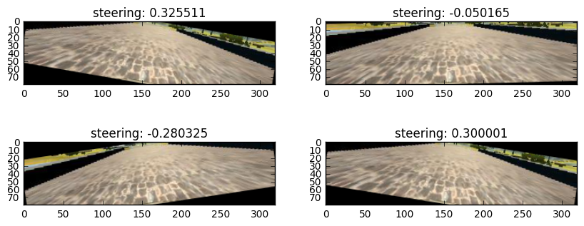
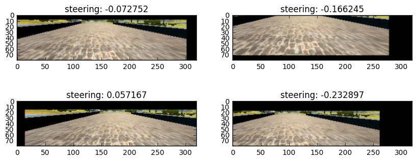
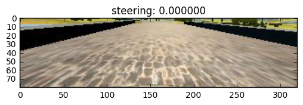
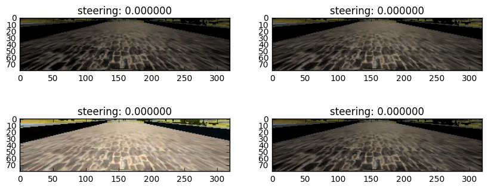
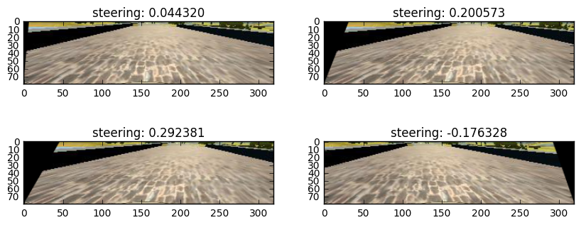
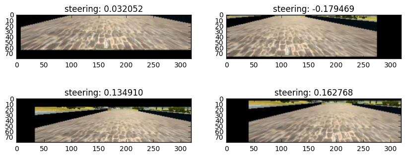

## Summary

I have tried to train the model on images from the center camera. At the beginning, the training error (rmse) could go down to 1e-7, however, the car drives horribly. This has been an epic example of overfitting the data.

Then I realize that the car cannot recover from the side of the road. Very naturally, I thought about correct this. Therefore I decided to use the images from both the left and right camera. Imagine the left camera image is what the center camera sees, then the steering angle should be more positive in this case. The same logic applies to the right camera training image, but in this case the angle should be more negative so as to move the car back to the center. 

After this, the car improves a little bit in driving. Nevertheless, in the autonomous mode, there are so many situations that my model has not seen before, I decide to try more wild ideas by shearing the image and correct for the steering angle, randomly shift the image and correct the angle. Overall this augmentation could improve the autonomous driving on track 1. 

Failure comes when I switch to track 2. One obvious difference is that track two is dark. So I return back to my training set and randomly change my training images to be darker or lighter to account for possible unseen road. In the end, my toy car could drive on track 2 as well (with 0.3 throttle).


```python
import pandas as pd
from keras.preprocessing.image import load_img
import numpy as np
import cv2
import pylab as plt
%matplotlib inline
```

    Using TensorFlow backend.


```python
crop_y = [60, 140]
RESIZE = (64, 64)


def get_one_image(image_file):
    """
    Read in one image file

    :param image_file: (str) full path of an image
    :return: (numpy.ndarray) image ndarray
    """

    image = np.asarray(load_img(image_file.strip()))
    return image


def crop_image(image, crop_y):
    """
    Crop the image with crop_y range

    :param image: (numpy.ndarray) image ndarray
    :param crop_y: (list) two item list or tuple providing the cropping range
    :return: (numpy array) cropped image ndarray
    """
    return image[crop_y[0]:crop_y[1], :, :]


def resize_image(image, RESIZE):
    """
    resize the image

    :param image: (numpy.ndarray) image ndarray
    :param RESIZE: (list) image size, length 2 tuple or list
    :return: (numpy array) image ndarray after resizing
    """
    image = cv2.resize(image, RESIZE, cv2.INTER_AREA) 
    return image


def get_one_image_crop(image_file, crop_y):
    """
    Buddle of two functions

    :param image_file: (numpy.ndarray) image file path
    :param crop_y: (list) crop range
    :return: (numpy array) cropped image
    """
    return crop_image(get_one_image(image_file), crop_y)


def shift_image(image, steering_angle, magx=120, magy=40):
    """
    Shift the image both horizontally and vertically, correspondingly
    the steering angles change. If the image is shifted to the left, we expect
    the new steering angle would be greater. On the other hand, if the image is
    shifted to the right, the angle should be smaller. Here I am using the change
    factor of 0.004/px.

    :param image: (numpy.ndarray) image ndarray
    :param steering_angle: (float) steering angle
    :param magx: (float) magnitude of x direction shift
    :param magy: (float) magnitude of y direction shift
    :return: (tuple) the shifted image, new_steering angle
    """
    rows, cols, _ = image.shape
    tx = magx*(np.random.rand(1) - 0.5)
    ty = magy*(np.random.rand(1) - 0.5)
    image = cv2.warpAffine(image, np.float32([[1, 0, tx], [0, 1, ty]]), (cols, rows))
    steering_angle = steering_angle + 0.004*(+tx) + 0.004 * ty * np.sign(steering_angle)
    return image, steering_angle


def flip_image(image, steering_angle):
    """
    Flip the image horizontally and change the steering angle sign

    :param image: (numpy.ndarray) image ndarray
    :param steering_angle: (float) steering angle
    :return: (tuple) flipped image ndarray, new_steering_angle
    """
    return image[:, ::-1, :], -steering_angle


def change_brightness(image, steering_angle):
    """
    Change the brightness of the road without changing steering angle

    :param image: (numpy.ndarray) image ndarray
    :param steering_angle: (float) steering angle
    :return: (tuple), image and new steering angle

    """
    scale = int((np.random.rand(1) - 0.8)*255)
    image = cv2.cvtColor(image, cv2.COLOR_RGB2HSV)
    image[:, :, 2] = cv2.add(image[:, :, 2], scale)
    image = cv2.cvtColor(image, cv2.COLOR_HSV2RGB)
    return image, steering_angle


def random_rotation(image, steering_angle, mag=20):
    """
    Randomly rotate the image and change the steering angle correspondingly

    :param image: (numpy.ndarray) image ndarray
    :param steering_angle: (float) steering angle
    :param mag: (float) magnitude of rotation
    :return: (tuple) rotated image, new steering angle
    """
    rotate_angle = mag * (np.random.rand(1) - 0.5)
    rows, cols, _ = image.shape
    M = cv2.getRotationMatrix2D((cols/2, rows/2), rotate_angle, 1)
    image = cv2.warpAffine(image, M, (cols, rows))
    steering_angle -= rotate_angle / 30.0
    return image, steering_angle


def shear_image(image, steering_angle, mag=80):
    """
    Shear the image and change the steering angle

    :param image: (numpy.ndarray) image ndarray
    :param steering_angle: (float) steering angle
    :param mag: (float) magnitude of shearing
    :return: (tuple) sheared image, new steering angle
    """
    rows, cols, _ = image.shape
    shear_angle = (np.random.rand(1)-0.5)*mag
    pts1 = np.float32([[0, 80], [320, 80], [shear_angle+100, 0], [shear_angle + 320-100, 0]])
    pts2 = np.float32([[0, 80], [320, 80], [100, 0], [220, 0]])
    m = cv2.getPerspectiveTransform(pts1, pts2)
    image = cv2.warpPerspective(image, m, (cols, rows))
    return image, steering_angle - shear_angle / 160. 
```


```python
image_index = pd.read_csv('driving_log.csv')
image_index.head()
```


<div>
<table border="1" class="dataframe">
  <thead>
    <tr style="text-align: right;">
      <th></th>
      <th>center</th>
      <th>left</th>
      <th>right</th>
      <th>steering</th>
      <th>throttle</th>
      <th>brake</th>
      <th>speed</th>
    </tr>
  </thead>
  <tbody>
    <tr>
      <th>0</th>
      <td>IMG/center_2016_12_01_13_30_48_287.jpg</td>
      <td>IMG/left_2016_12_01_13_30_48_287.jpg</td>
      <td>IMG/right_2016_12_01_13_30_48_287.jpg</td>
      <td>0.0</td>
      <td>0.0</td>
      <td>0.0</td>
      <td>22.148290</td>
    </tr>
    <tr>
      <th>1</th>
      <td>IMG/center_2016_12_01_13_30_48_404.jpg</td>
      <td>IMG/left_2016_12_01_13_30_48_404.jpg</td>
      <td>IMG/right_2016_12_01_13_30_48_404.jpg</td>
      <td>0.0</td>
      <td>0.0</td>
      <td>0.0</td>
      <td>21.879630</td>
    </tr>
    <tr>
      <th>2</th>
      <td>IMG/center_2016_12_01_13_31_12_937.jpg</td>
      <td>IMG/left_2016_12_01_13_31_12_937.jpg</td>
      <td>IMG/right_2016_12_01_13_31_12_937.jpg</td>
      <td>0.0</td>
      <td>0.0</td>
      <td>0.0</td>
      <td>1.453011</td>
    </tr>
    <tr>
      <th>3</th>
      <td>IMG/center_2016_12_01_13_31_13_037.jpg</td>
      <td>IMG/left_2016_12_01_13_31_13_037.jpg</td>
      <td>IMG/right_2016_12_01_13_31_13_037.jpg</td>
      <td>0.0</td>
      <td>0.0</td>
      <td>0.0</td>
      <td>1.438419</td>
    </tr>
    <tr>
      <th>4</th>
      <td>IMG/center_2016_12_01_13_31_13_177.jpg</td>
      <td>IMG/left_2016_12_01_13_31_13_177.jpg</td>
      <td>IMG/right_2016_12_01_13_31_13_177.jpg</td>
      <td>0.0</td>
      <td>0.0</td>
      <td>0.0</td>
      <td>1.418236</td>
    </tr>
  </tbody>
</table>
</div>


```python
img_center =get_one_image_crop(image_index.iloc[0]['center'], crop_y)
```

## Random rotation


```python
plt.imshow(img_center[:,:,:])
plt.title('steering: %f' % 0)
plt.figure(figsize=(10,4))
for i in range(4):
    plt.subplot(2,2,i+1)
    img, angle = random_rotation(img_center, 0)
    plt.imshow(img)
    plt.title('steering: %f' % angle)
```





## Random translation


```python
plt.imshow(img_center[:,:,:])
plt.title('steering: %f' % 0)
plt.figure(figsize=(10,4))
for i in range(4):
    plt.subplot(2,2,i+1)
    img, angle = shift_image(img_center, 0)
    plt.imshow(img)
    plt.title('steering: %f' % angle)
```





## Random brightness


```python
plt.imshow(img_center)
plt.title('steering: %f' % 0)
plt.figure(figsize=(10,4))
for i in range(4):
    plt.subplot(2,2,i+1)
    img, angle = change_brightness(img_center, 0)
    plt.imshow(img)
    plt.title('steering: %f' % angle)
```








## Random shear


```python
plt.imshow(img_center)
plt.title('steering: %f' % 0)
plt.figure(figsize=(10,4))
for i in range(4):
    plt.subplot(2,2,i+1)
    img, angle = shear_image(img_center, 0,100)
    plt.imshow(img)
    plt.title('steering: %f' % angle)
```





## Random shift 


```python
plt.imshow(img_center)
plt.title('steering: %f' % 0)
plt.figure(figsize=(10,4))
for i in range(4):
    plt.subplot(2,2,i+1)
    img, angle = shift_image(img_center, 0,100)
    plt.imshow(img)
    plt.title('steering: %f' % angle)
```





```python

```
